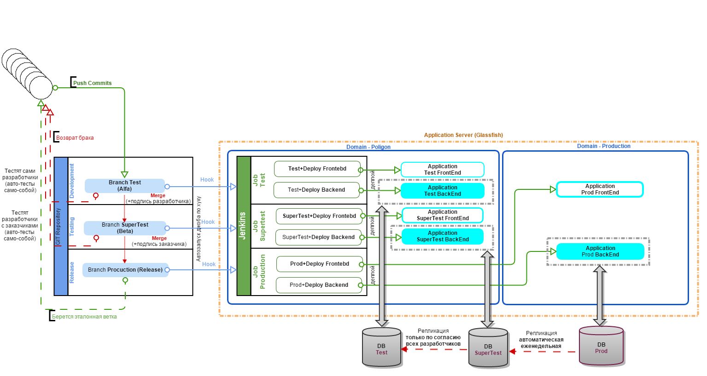

## Правила взаимодействия с ветками репозитория, в процессе разработки:

 1. Создать fork репозитория в личный GitHub аккаунт
 2. Выбрать задачу для работы (**feature**)
 3. Создать ветку **featureBranch**, выполнять все изменения в ней
 4. По окончании работы (или при необходимости совместных обсуждений) создать **Pull Request**: **yourAccount/i/featureBranch** в **e-government-ua/i/test** (может переименовать? выглядит как временная ветка)
 5. После окончания работы, ревью и подтверждения **Pull Request** - деплой происходит автоматически (длится около 2-х минут), по настроенной джобе: https://jenkins.igov.org.ua/job/central_alpha/

В описании джобы(ов) указаны сервера, куда это продеплоится, и на текущий момент это:
 – портал: https://poligon.igov.org.ua 
 – активити: http://poligon.igov.org.ua/admin

Когда есть уверенность, что в тестовой ветке все в порядке, явных ошибок нет, то можно смержить содержимое ветки test в ветку master (после мержа также автоматом произойдет ре-деплой (тоже около 2-х минут), но уже на боевой сервак, по джобу: https://jenkins.igov.org.ua/job/central_release/)

 - это можно сделать попросив об этом тут: https://e-government-ua.slack.com/messages/deploy/
 - это так-же можно сделать самостоятельно (читай ниже)

Общая схема работы:

